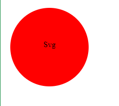

# SVG_logo_maker

[video link](https://drive.google.com/file/d/1s_4boUpmwvlVL8A89yjyWviOFd86X4Cy/view)

## Description

Creates custom SVG logos with ease, command line SVG logo maker.
This tool allows you to specify text, background color, text color,
and choose from different shapes to generate SVG logos for your branding needs.

## Table of contents

- [Installation](#installation)
- [Usage](#usage)
- [Feature](#features)
- [Examples](#)
- [Contributions](#contributions)
- [License](#license)


## Installation

To use the SVG logo maker, follow these steps:

1. Clone the repository to the local machine:
```
git clone https://github.com/sharktank3800/SVG_logo_maker.git
```
2. Change to the project directory:

```
cd svg-logo-maker
```
3. Install the required dependencies:

``` 
npm install
```

## Usage

To create ann SVG log run the following command:
`node index.js`

Follow the on screen prompts to enter the text, background color, text coloor and choose a shape for your logo. Once completed the generated SVG logo wll be saved as 'logo.svg' in the project directory.

## Features

- Generate custom SVG logos with text, colors, and shapes.
- Choose from different shapes: circle, triangle, square.
- Specify background color and text color.
- Simple and easy-to-use command-line interface.
- Save generated logos as SVG files for further use.


## Examples
1. 


2. 


3. 


## Contributions

Contributions are welcome! If you would like to contribute to this project, please follow these guidlines:

1. Fork the repository.
2. Createa a new branch for your feature or bug fix.
3. Make your changes and commit them with descriptive messages.
4. Push your changes to your fork.
5. Submit a pull request to the main repository.


## License

This project is licensed under the MIT license - see the [LICENSE](LICENSE) file for details.
